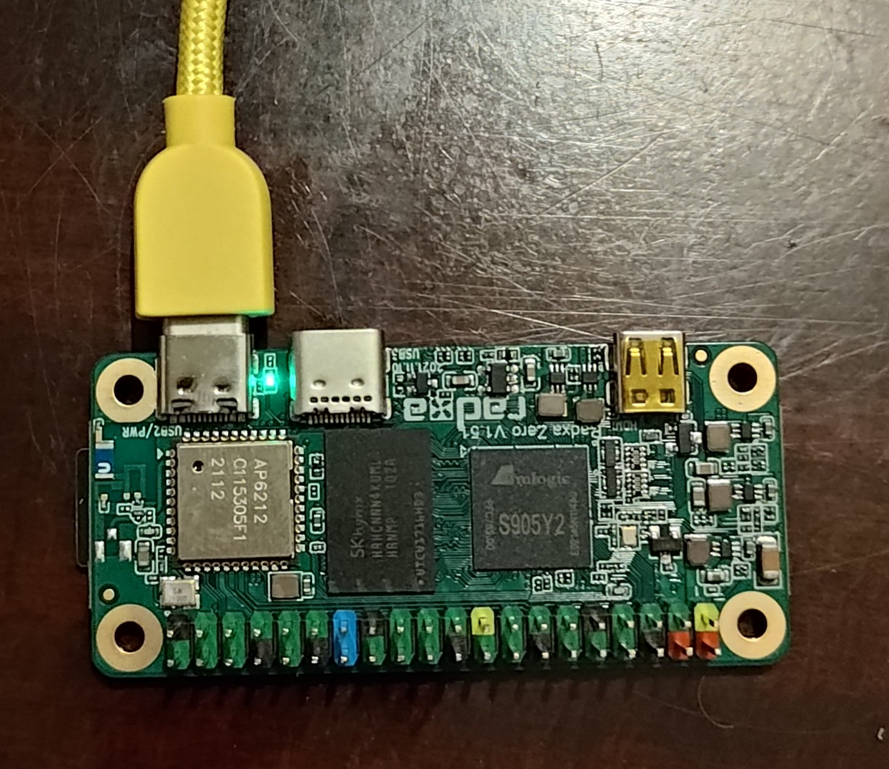

# Docs for setting up Beeper HW

## Instructions for Radxa

#### Get hardware ready

1. Download [https://github.com/radxa-build/radxa-zero/releases/download/20220801-0213/radxa-zero-ubuntu-focal-server-arm64-20220801-0346-mbr.img.xz](https://github.com/radxa-build/radxa-zero/releases/download/20220801-0213/radxa-zero-ubuntu-focal-server-arm64-20220801-0346-mbr.img.xz)
2. Etch this image to an SD using [Etcher](https://www.balena.io/etcher/) and insert into SD slot on Radxa
3. Plug only the Radxa into your computer. Use the Radxa corner USB C port. Like this:

4. wait 2 minutes for it to boot and resize partition

#### Configure Radxa
1. `./adb devices` to confirm that the Radxa is there. Use the correct `adb` for your system, included in this repo.
2. `./adb shell`
3. `echo "PermitRootLogin yes" >> /etc/ssh/sshd_config`
4. `passwd`
    1. enter new pw
5. `nmcli radio wifi on`
6. `nmcli dev wifi connect "your ssid" password "your password"`
    1. may need to try a few times until it connects
7. `ip a | grep -A 2 'wlan0' | grep inet`
    1. will show you 2 IP addresses for some reason, pick one
8. `reboot now` and wait 15s for it to reboot
9. `ssh root@<ip address from step above>`
10. `apt update && apt install -y wget`
11. `wget https://raw.githubusercontent.com/beeper/beeper-beeper/main/setup.sh`
12. `chmod +x setup.sh && ./setup.sh`

Setup should take 3-4 minutes.

#### Connect Radxa to Beeper PCB
1. unplug from computer
2. insert Radxa into Beeper pcb and attach battery

3. Charge from bottom USB C port
4. Slide powerswitch to on (right)
5. Login with root/pw using built-in keyboard
6. `cd bbq10kbd-kernel-driver/`
7. `loadkeys bbq10kbd`

*Make sure you double check the polarity of the battery connector before insert the battery!*

- mic button is ctrl, alt is alt, and then sym for the character overlay

- alt+speaker = tab

- alt + h,j,k,l for up down left right but up/down doesn't seem to work in bash

## Other SBC
[Instructions for Raspberry Pi (outdated)](/raspberrypi/README.md)

